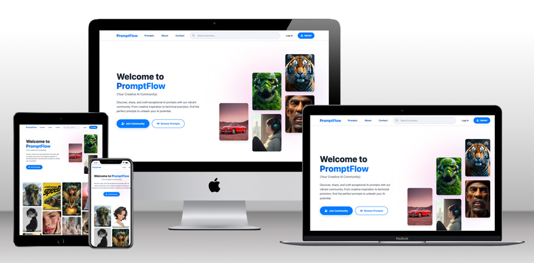

---

<h1 align="center"><strong>PromptFlow</strong>

---

## Welcome to PromptFlow – Your Creative AI Community!

Developed for Project 4 of the Code Institute Full-Stack Development Program, this prompt sharing project is a full-stack Django project hosted on Heroku.

**PromptFlow** is a community platform built for creators who work with AI image generation. Each prompt is paired with a preview image, allowing users to browse, share, and search through a growing collection of visual references and the exact text that generated them. The result is a practical resource for creative development, experimentation, and learning.

The platform supports both beginners and experienced users by making the prompt-writing process transparent and easy to explore. By allowing members to comment on and like prompts, PromptFlow encourages ongoing participation and shared learning within the community.

The homepage is designed to highlight the most recent prompts first, encouraging frequent visits and steady user engagement. This content flow not only keeps the experience fresh but also contributes to long-term SEO performance by increasing time on site and activity across the platform.

## [LIVE SITE](https://mj-project-4-68750ca94690.herokuapp.com/)

## [GITHUB RESPOSITORY](https://github.com/jtraveler/project-4)

# Content
* [PromptFlow](#promptflow)
* [Project Overview](#prject-overview)
* [Goal & UX](#goal--ux)
  * [Website Structure](#website-structure)
  * [Responsiveness](#responsiveness)
* [Wireframes](#wireframes)
* [Development Process](#development-process)
* [Future Adding](#future-adding)
* [Agile Methodology](#agile-methodology)
* [Testing](#testing)
* [Features](#features)
  * [Technologies Used](#technologies-used)
  * [Libraries](#libraries)
  * [VsCode migration](#vs-code-migration)
  * [PostgreSQL Setup](#postgresql-setup)
  * [Deployment](#deployment)
* [Acknowledgements](#acknowledgements)

# Goal & UX

## Project Overview  

**PromptFlow** is designed to provide an engaging and interactive space for gardeners to share their prompts and learn from one another. Users can explore and submit their own AI image prompts, and participate in discussions through comments.  

##  Project Goals  

- **Creative Resource Hub:** Build a comprehensive platform where AI creators can discover, share, and explore prompt-image pairs for visual inspiration and learning.  
- **Transparent Learning Environment:** Make the prompt-writing process accessible by pairing every AI-generated image with its exact text prompt, enabling users to understand and replicate techniques.  
- **Community-Driven Engagement:** Foster active participation through likes, comments, and prompt sharing, creating a collaborative space for knowledge exchange and creative growth.  
- **Intuitive Discovery Experience:** Provide seamless browsing, searching, and filtering capabilities that help users quickly find relevant prompts and visual references for their projects.  
- **Fresh Content Prioritization:** Design the homepage to showcase the most recent prompts first, encouraging regular visits and maintaining an active, evolving creative resource.  
- **Responsive Creative Workflow:** Ensure optimal functionality across all devices so creators can access inspiration and share discoveries whether at their workstation or on mobile.  

##  First-Time Visitors' Experience  

- **Explore Visual Inspiration:** Browse through a diverse collection of AI-generated images paired with their exact prompts to spark creative ideas.
- **Clear Signup Incentives:** Non-members are gently guided to join when they attempt to upload prompts, like images, or access full prompt details and comments, making the value of membership immediately apparent. 
- **Search by Style or Topic:** Easily discover specific types of prompts using tags, keywords, or visual themes relevant to their creative projects.  
- **Learn Prompt Techniques:** Study successful prompt structures and understand how different text approaches create varying visual results.  
- **Engage with Community:** Like prompts they find inspiring and leave comments to ask questions or share insights with other creators.  
- **Understand the Platform:** Learn about PromptFlow's mission to make AI prompt creation transparent and accessible to all skill levels.  

##  Returning Visitors' Experience  

- **Share Their Creations:** Upload their own successful prompt-image combinations to contribute to the community knowledge base.  
- **Track Popular Content:** Not at the moment but eventully the user will be able to visit liked prompts and follow comment discussions on posts they've engaged with previously.  
- **Discover Latest Trends:** Stay current with newly added prompts and emerging techniques in AI image generation.  
- **Build Their Reputation:** Gain recognition through likes and comments on their shared prompts, establishing themselves within the creator community.  

##  Frequent Visitors' Experience  

- **Stay at the Creative Forefront:** Regularly check for the newest prompt innovations and trending techniques from fellow creators.  
- **Become a Knowledge Contributor:** Consistently share high-quality prompts, helping to build the platform's value as a creative resource.  
- **Foster Community Growth:** Mentor newcomers through thoughtful comments and engagement, strengthening the collaborative learning environment.  
- **Develop Advanced Skills:** Continuously refine their prompt-writing abilities by studying and experimenting with techniques shared by the community.

# Website Structure of Main Templates

## Page Structure Overview

| Page | Template | Main Purpose | Key Features | User Access |
|------|----------|--------------|--------------|-------------|
| **Homepage/Landing** | `index.html` | Welcome users and showcase latest prompts | Hero section, masonry grid, search, load more | All users |
| **Prompt Detail** | `prompt_detail.html` | Display full prompt content and enable interaction | Full image, prompt text, tags, likes, comments | All users (limited for non-members) |
| **Create Prompt** | `prompt_create.html` | Allow users to share new prompts | Upload form, image preview, tags, rich text editor | Members only |
| **Edit Prompt** | `prompt_edit.html` | Enable prompt authors to modify their content | Pre-filled form, image replacement, tag editing | Prompt author only |
| **About** | `about.html` | Explain platform purpose and team information | Mission statement, features overview, team details | All users |
| **Contact** | `collaborate.html` | Provide contact form for user inquiries | Contact form, response messaging | All users |
| **Authentication Pages** | `account/*.html` | Handle user registration and login processes | Sign up, sign in, password reset flows | Non-members |
| **Search Results** | `index.html` | Display filtered prompts based on search query | Filtered prompt grid, search highlighting | All users |
| **Tag Filter** | `index.html` | Show prompts filtered by specific tags | Tag-based filtering, prompt count display | All users |
| **404 Error** | `404.html` | Handle page not found errors gracefully | Error message, navigation back to homepage | All users |

## Key Navigation Elements

- Header Navigation: Logo, search bar, user menu, upload button
- Authentication Flow: Login/signup prompts for non-members accessing restricted features 
- Responsive Design: Mobile-optimized navigation and content layout
- Footer: Social links, additional navigation, platform information

## Page Details

### Home Page (`index.html`)
- Features a hero section with PromptFlow branding and call-to-action buttons for new users. Also included in the hero section are supportive images that move upon hover for fun interaction.
- Displays masonry grid layout showcasing the latest AI preview images for prompts
- Shows like counts and author username on each prompt preview image. Users can like/unlike image with the like count button.
- Implements "Load More" button to show more preview images
- Prioritizes fresh content to encourage frequent visits

[Insert image of homepage hero section and masonry grid]

### Prompt Detail Page (`prompt_detail.html`)
- Displays full-size featured image
- Displas the complete prompt text to members only. Non members will be invited to signup to see the prompt
- Shows detailed metadata including author, creation date, and tags
- Includes user interaction features:
  - Like/Unlike Button - Members can show appreciation for prompts
  - Copy Prompt Button - Easy copying of prompt text for reuse
  - Edit/Delete Buttons - Available only to prompt authors
  - Comment Section - Community discussion and feedback
- Comment Form - Non members will be invited to signup to comment
- Features clickable tags for related content discovery
- Provides responsive image display optimized for all devices with using the Cloudinary image optimization options.

[Insert image of prompt detail page showing full image and prompt text]
[Insert image of comment section and interaction buttons]

### Create Prompt Page (`prompt_create.html`)
- Features intuitive upload form with image upload functionality
- Includes rich text editor for prompt description and content
- Provides tag selection system with tag suggestions
- Implements form validation to ensure quality submissions
- Includes confirmation dialog upon submission

[Insert image of create prompt form and upload interface]

### Edit Prompt Page (`prompt_edit.html`)
- Pre-populates form with existing prompt data for easy modification
- Allows image replacement while showing existing image in place
- Enables tag editing and content updates
- Includes confirmation dialog upon saving

[Insert image of edit prompt form with pre-filled data]

### About Page (`about.html`)
- Explains PromptFlow's mission and platform purpose
- Highlights community benefits

[Insert image of about page layout and content sections]

### Contact Page (`collaborate.html`)
- Features contact form with simplistic fields for name, email and message
- Implements form validation and success messaging
- Includes confirmation dialog with response time expectation upon submission

[Insert image of contact form and information layout]

### Authentication Pages

#### Sign Up Page (`account/signup.html`)
- Features streamlined registration form with essential fields only
- Features mobile-optimized form layout
- Implements form validation to ensure quality submissions

[Insert image of signup form and validation messages]

#### Sign In Page (`account/login.html`)
- Displays login interface with username/email and password
- Includes "Remember Me" option for convenience
- Features "Forgot Password" link for account recovery
- Provides error messaging for failed login attempts
- Shows registration link for new users

[Insert image of login form and layout]

#### Password Reset Pages (`account/password_reset.html`)
- Password Reset Request: Simple email input form with instructions
- Email Sent Confirmation: Success message with next steps guidance

[Insert image of password reset flow screens]

### Search Results (`index.html` with search parameters)
- Displays filtered prompt grid based on search query
- Shows search term highlighting in results
- Includes result count and search refinement options
- Features "no results" messaging for no results and a button for going to the prompt feed

[Insert image of search results page with highlighted terms]

### Tag Filter Page (`index.html` with tag parameter)
- Shows prompts filtered by specific tag with tag name display
- Includes prompt count for the selected tag
- Maintains masonry layout for visual consistency

[Insert image of tag-filtered results with tag information]

### 404 Error Page (`404.html`)
- Features friendly error message with helpful guidance
- Includes buttons to go back tp the previous page they were on or view main prompt feed
- Maintains site branding and design consistency

[Insert image of 404 error page design]

### Common Elements on All Pages

- **Navigation Bar**  
  The main navigation stays at the top of every page and includes all important site features.  
  The navigation contains:
  - **PromptFlow Logo** - Click to return to the homepage
  - **About** - Learn about the platform and its purpose
  - **Contact** - Page to get in touch with the team
  - **Search Bar** - Find prompts by typing keywords
    - Search looks through prompt titles, descriptions, and tags
    - Results show matching prompts instantly
    - Empty search displays all available prompts
    - Works on all device sizes

  - **For Logged-in Users:**
    - **Welcome Message** - Shows "Welcome back, [username]!"
    - **Upload Button** - Blue button to create new prompts quickly
    - **User Menu** - Access to profile and logout options

  - **For Visitors:**
    - **Log In Button** - Link to sign in page
    - **Upload Button** - Takes visitors to login page first

[Insert image of desktop navigation bar with user logged in]

- **Mobile Navigation**  
  On phones and tablets, the navigation becomes mobile-friendly:
  - **Hamburger Menu** (☰) - Tap to open the menu
  - **Mobile Search** - Search function inside the mobile menu
  - **Touch-Friendly Buttons** - Easy to tap on mobile screens
  - **User Info** - Welcome message and options for logged-in users
  - **Quick Upload** - Upload button available in mobile menu

[Insert image of mobile navigation menu open]

- **Footer**  
  The footer appears at the bottom of all pages and includes:
  - **Social Media Links** - Connect on Facebook, Twitter, Instagram, LinkedIn, GitHub
  - **Platform Info** - About PromptFlow and copyright information
  - **Quick Links** - Fast navigation to key pages
  - **Contact Details** - Ways to reach support

[Insert image of footer with social media icons]

- **User Authentication**  
  Login and account features work the same across the site:
  - **Login/Logout** - Secure access to user accounts
  - **Registration** - Easy signup process for new users
  - **User Status** - Shows if you're logged in or not
  - **Protected Features** - Upload and edit require login

[Insert image of authentication elements]

- **Search and Filtering**  
  Search features work throughout the platform:
  - **Global Search** - Find prompts from any page
  - **Tag Filtering** - Click tags to see related prompts
  - **Real-time Results** - See results as you type
  - **Mobile Optimized** - Search works well on all devices

[Insert image of search results with tag filtering]

- **Responsive Design**  
  All page elements adapt to different screen sizes:
  - **Desktop View** - Full navigation and features
  - **Tablet View** - Adjusted layout for medium screens
  - **Mobile View** - Touch-friendly design for phones
  - **Consistent Experience** - Same features on all devices

[Insert image showing responsive design across devices]

# Responsiveness

## Core Platform Pages

**PromptFlow** features a fully responsive design with masonry grid layout for the prompt feed and search, mobile-optimized navigation, and touch-friendly interactions. Built with Bootstrap and custom CSS, ensuring seamless experience across all devices with adaptive content layouts and optimized image loading with using Cloudinary.

- **Homepage/Landing Page**: Dynamic masonry grids with responsive column counts (4 columns desktop → 2 tablet → 1 mobile).

- **Prompt Detail Page**: Full-featured prompt viewing with responsive image display and mobile-optimized action buttons.

- **Create Prompt Page**: Intuitive upload form with upload functionality and mobile-friendly file selection.

- **Edit Prompt Page**: Pre-filled editing interface with responsive form layout.

- **About Page**: Clean informational layout with responsive text columns and image optimization.

- **Contact Page**: Mobile-friendly contact form with optimized input fields and touch-accessible buttons.

## User Authentication & Management Pages

**PromptFlow** includes comprehensive authentication flows, search functionality, and error handling pages, all designed with modern responsive principles and accessibility standards. Features mobile-first design with touch-optimized forms and adaptive layouts.

- **Sign-Up Page**: Streamlined registration with mobile-optimized form validation.

- **Sign-In Page**: Clean login interface with responsive layout and "Remember Me" functionality.

- **Sign-Out Page**: Confirmation interface with clear action buttons and responsive messaging.

- **Password Reset Pages**: Multi-step reset process with mobile-friendly forms and clear progress indicators.

- **Search Results Page**: Responsive prompt grid with search highlighting and mobile-optimized filtering.

- **Tag Filter Page**: Dynamic content displayed in a grid with filtering, responsive tag display and mobile-friendly layout.

- **404 Error Page**: User-friendly error handling with responsive layout and helpful buttons.

## Key Responsive Features

- **Adaptive Navigation**: Desktop navigation bar transforms to mobile hamburger menu with slide-out functionality
- **Masonry Grid System**: Intelligent column adjustment (4→3→2→1) based on screen size for optimal content display
- **Touch-Optimized Interactions**: Like buttons, upload areas, and form elements sized for mobile interaction
- **Progressive Image Loading**: Responsive images with automatic format optimization and lazy loading
- **Mobile-First Forms**: Touch-friendly input fields with improved validation messaging and accessibility
- **Flexible Typography**: Scalable text hierarchy that maintains readability across all device sizes

# Wireframes

## Homepage Layout

The **Homepage** serves as the main landing page and content discovery hub:

- **Hero Section** - Welcome message and platform introduction with call-to-action buttons
- **Masonry Grid** - Dynamic layout showcasing latest AI prompts with preview images
- **Search & Navigation** - Global search functionality and intuitive navigation menu
- **Load More** - Infinite scroll experience(assuming many prompts available) for seamless content browsing. 

### Desktop

### Mobile

## Prompt Detail Page Layout

The **Prompt Detail Page** provides comprehensive prompt viewing and interaction:

- **Featured Image Display** - Large, prominent image showcase
- **Prompt Information** - Title, description, actual prompt text, and metadata
- **Interactive Elements** - Like buttons, tags, and sharing options
- **Comments Section** - Community discussion and feedback area
- **Responsive Layout** - Optimized content flow for all device sizes

### Desktop

### Mobile

## About Page Layout

The **About Page** explains the platform's mission and features:

- **Content Sections** - Platform information, mission statement, and feature highlights
- **Visual Elements** - Supporting imagery and branding elements

### Desktop

### Mobile

## Form Pages Template Layout

**Contact, Create Prompt, Edit Prompt, Authentication Pages** share consistent form design:

- **Centered Form Design** - Clean, focused user input experience
- **Form Fields** - Appropriately sized input fields with clear labels
- **Action Buttons** - Prominent submit buttons with secondary options
- **Responsive Design** - Mobile-optimized form layouts with touch-friendly elements
- **Validation** - Clear error messaging and success feedback

**Note:** All form pages (Contact, Create Prompt, Edit Prompt, Sign Up, Sign In, Password Reset) follow this same layout structure with content-specific modifications.

### Desktop

### Mobile

## Design Consistency

All wireframes demonstrate:
- **Unified Navigation** - Consistent header with logo, search, and user menu
- **Responsive Grid System** - Adaptive layouts across device sizes
- **Visual Hierarchy** - Clear content prioritization and flow
- **User Experience Focus** - Intuitive interaction patterns and accessibility considerations

# Future Adding

### Advanced Search Filters
Users will be able to filter prompts by AI model type, image style and creation date ranges for more precise content discovery.

### User Profile Pages
Individual profile pages displaying user's uploaded prompts, liked content, follower count, and personal prompt creation statistics.

### Prompt Collections/Favorites
Users can organize prompts into custom collections and bookmark favorites for easy access and reference.

### Social Features Enhancement
- Follow other creators to see their latest prompts in a personalized feed
- Share prompts directly to social media platforms
- Prompt collaboration features for community projects

### Advanced Commenting System
- Edit and delete comment functionality for comment authors
- Nested reply system for threaded discussions
- Comment moderation tools for prompt authors

### Notification System
Real-time notifications for likes, comments, follows, and when favorite creators upload new prompts.

### Prompt Versioning
Track prompt iterations and improvements, allowing users to see the evolution of successful prompts.

### Advanced Analytics
- Prompt performance metrics and trending analysis
- User engagement statistics and popular tag insights
- Creator dashboard with detailed prompt analytics

### Mobile Application
Native iOS and Android apps for seamless mobile prompt browsing and creation experience.

### Custom Error Pages
Enhanced 500 error page and other HTTP error responses with helpful navigation and troubleshooting guidance.

# Agile Methodology

This project was built using the [Project 4 - Prompts Kanban Board](https://github.com/users/jtraveler/projects/4/views/1). This approach helped me build PromptFlow step by step and make changes as needed during development.

I used GitHub Issues and Projects to organize my work. The platform's features were grouped into Epics, with each Epic containing smaller User Stories. An Epic covers a major feature area, while User Stories focus on what users need to do. I used a simple board with three columns: To Do, In Progress, and Done to track my progress.

## Epic Organization

I organized the entire project into **4 main epics** that cover everything the platform does:

- **[EPIC] Core Platform Features** - Basic features like user accounts, creating prompts, and main navigation
- **[EPIC] Community Features** - Ways users interact with each other through comments and likes
- **[EPIC] Discovery & Search Features** - Tools to help users find prompts through search and tags
- **[EPIC] Performance & UX** - Making the site fast and easy to use on all devices

Each epic had several user stories that moved through the board as I worked on them. Stories started in To Do, moved to In Progress when I began working, and ended in Done when they were finished and tested.

# Technologies Used

| Technology | Location | Purpose |
| ------------------------------------------------- | -------------- | ---------------------------- |
| [Python](https://www.python.org/) | Backend | Main programming language for Django development |
| [Django](https://www.djangoproject.com/) | Backend | Web framework for building the application |
| [PostgreSQL](https://www.postgresql.org/) | Database | Production database on Heroku |
| [SQLite](https://www.sqlite.org/) | Database | Development database for local testing |
| [HTML5](https://developer.mozilla.org/en-US/docs/Web/HTML) | Frontend | Structure and content of web pages |
| [CSS3](https://developer.mozilla.org/en-US/docs/Web/CSS) | Frontend | Styling and layout design |
| [JavaScript](https://developer.mozilla.org/en-US/docs/Web/JavaScript) | Frontend | Interactive features and AJAX functionality |
| [Bootstrap 5](https://getbootstrap.com/) | Frontend | Responsive design and UI components |
| [Cloudinary](https://cloudinary.com/) | Media Storage | Image upload, storage, and optimization |
| [Heroku](https://www.heroku.com/) | Deployment | Cloud platform for hosting the application |
| [Git](https://git-scm.com/) | Version Control | Code versioning and tracking changes |
| [GitHub](https://github.com/) | Code Repository | Online code storage and project management |
| [VSCode](https://code.visualstudio.com/) | Development | Code editor and development environment |
| [Django Allauth](https://django-allauth.readthedocs.io/) | Authentication | User registration, login, and account management |
| [Django Summernote](https://github.com/summernote/django-summernote) | Content Editor | Rich text editor for content creation |
| [Crispy Forms](https://django-crispy-forms.readthedocs.io/) | Form Styling | Bootstrap form styling and layout |
| [Whitenoise](https://whitenoise.evans.io/) | Static Files | Serving static files in production |
| [Taggit](https://django-taggit.readthedocs.io/) | Tagging System | Tag functionality for prompts |
| [ClaudeAI](https://claude.ai//)   | Across website |Content writing, debugging actions |
| [Font Awesome](https://fontawesome.com/) | Icons | Icons for user interface elements |
| [Google Fonts](https://fonts.google.com/) | Typography | Custom fonts (Roboto and Open Sans) |
| [Balsamiq](https://balsamiq.com/) | Design | Wireframe creation and project planning |

# Libraries

## The following libraries and dependencies are used in this project:

- **Django** `v5.2.3` - A high-level Python web framework for building robust web applications with clean design patterns.
- **Cloudinary** `v1.42.0` - Cloud-based media management for image upload, storage, optimization, and delivery.
- **Django-Allauth** `v0.57.0` - Complete authentication system handling user registration, login, logout, and account management.
- **Django-Summernote** `v0.8.20` - Rich text editor integration providing WYSIWYG editing capabilities for content creation.
- **Django-Crispy-Forms** `v2.0` - Enhanced form rendering with Bootstrap styling and layout control.
- **Crispy-Bootstrap5** `v0.7` - Bootstrap 5 template pack for Django Crispy Forms providing modern form styling.
- **Django-Taggit** `v4.0.0` - Tagging system for adding tag functionality to Django models.
- **Gunicorn** `v21.2.0` - Python WSGI HTTP server for deploying Django applications in production.
- **Whitenoise** `v6.5.0` - Serves static files directly from Django application without requiring separate web server.
- **Psycopg2-binary** `v2.9.7` - PostgreSQL adapter for Python enabling database connectivity.
- **Pillow** `v10.0.0` - Python Imaging Library providing image processing capabilities.
- **dj-database-url** `v2.1.0` - Utility for parsing database URLs from environment variables.
- **Python-decouple** `v3.8` - Separates settings from code by using environment variables.
- **Django-CSP** `v3.7` - Content Security Policy middleware for enhanced web security.

# VS Code Migration

## Development Environment

This project was developed using VS Code as the primary IDE with Python virtual environment setup.

## Tutorial Implementation References

1. **Django Project Initial Setup Tutorial**  
   [Initial Setup Guide](https://docs.google.com/document/d/e/2PACX-1vTrL4s5fkIY_SJXjazXiAd6LDKjS7uZMHwY9XW6REJ2T_DyCGRRjjmW-0p4NnkomUwAAru0vLYALohwY/pub)

2. **Django Migrations Tutorial**  
   [Migrations Tutorial Guide](https://docs.google.com/document/d/e/2PACX-1vRfWv2mSizbxD_QjmDlF-g87-WuKnaO6tAiJf6XrkgLZO6laULxBKPGgd9pB9v8q0TC_huVYJjSuwOp/pub)

3. **Frontend Views & Templates Tutorial**  
   [Views & Templates Guide](https://docs.google.com/document/d/e/2PACX-1vQeVAArk8HaowmShcEPYMQlK5D0hVt6XNVmr8YBmazARdk9Lj-8XA_xs3YmwTnxTCFNxCQJ_JQ9bbhw/pub)

4. **Comment System Implementation Tutorial**  
   [Comment System Guide](https://docs.google.com/document/d/e/2PACX-1vQ7l-NroI9uGHmAq0yoi0H7CisuXsOOadYlDUJhRAZ0esg4omMnMfw63dAeKj-Tt1Yw1yXI3rXc4wVI/pub)

5. **Heroku Deployment & PostgreSQL Setup Tutorial**  
   [Deployment Guide](https://docs.google.com/document/d/e/2PACX-1vTb7E-raldOfsbrYvwCCH6szv0WEq9SStBE4MV62D4w6QD4ujKBlNgoQd_tlYUV4r1SxPw8g9sDJPdt/pub)

## Development Configuration

- **IDE:** VS Code with Python extension
- **Environment:** Virtual environment (venv)
- **Version Control:** Git with GitHub integration
- **Deployment:** Heroku with automatic deployment enabled
- **Database:** PostgreSQL (production), SQLite (development)

## Project Implementation Notes

This project followed Code Institute's Django tutorial series, adapting the blog-style tutorials for a AI prompt sharing platform. Key adaptations included replacing "blog" references with "prompts" and "post" references with "prompt" throughout the codebase.

# PostgreSQL Setup

The production database was configured using PostgreSQL to ensure reliable data persistence on the Heroku platform. The database was provisioned through the Code Institute PostgreSQL database creation tool, which provided a managed database instance for the project.

The database connection was configured using environment variables, with the `DATABASE_URL` stored in the local `env.py` file for development and added to Heroku config vars for production. Required dependencies including `psycopg2-binary` and `dj-database-url` were installed to enable PostgreSQL connectivity.

Django settings were updated to use `dj_database_url.parse()` for automatic database connection handling, enabling seamless switching between SQLite for local development and PostgreSQL for production. Database migrations were successfully applied using `heroku run python manage.py migrate`, and a superuser account was created for admin access.

## Database Configuration:
- **Development:** SQLite database for local testing
- **Production:** PostgreSQL database on Heroku
- **Connection:** Automatic switching based on `DATABASE_URL` environment variable

# Deployment

| Step | Location | Description |
|------|----------|-------------|
| Cloning the Repository | GitHub & IDE | Copy the repository link from GitHub and clone it in your IDE. |
| Creating a GitHub Repository | GitHub | Set up a new repository for version control. |
| Installing Django & Dependencies | IDE | Install Django, Gunicorn, and required packages. |
| Creating requirements.txt | IDE | Generate a list of dependencies using `pip freeze --local > requirements.txt`. |
| Initializing Django Project | IDE | Start the Django project and verify by running the local server. |
| Creating .gitignore | IDE | Create `.gitignore` file to exclude unnecessary files from version control. |
| Updating ALLOWED_HOSTS | settings.py | Add `.herokuapp.com` to ALLOWED_HOSTS for deployment compatibility. |
| Setting DEBUG = False | settings.py | Disable debug mode for production security. |
| Creating a Django App | IDE | Create and register the `prompts` Django app. |
| Creating a Heroku App | Heroku | Log in to Heroku and create a new app with unique name `mj-project-4`. |
| Adding Config Vars | Heroku | Add `DISABLE_COLLECTSTATIC=1`, `SECRET_KEY`, and `DATABASE_URL`. |
| Installing Gunicorn | IDE | Install Gunicorn as the production WSGI server. |
| Creating a Procfile | IDE | Add `web: gunicorn prompts_manager.wsgi` to configure deployment. |
| Connecting GitHub to Heroku | Heroku | Link Heroku with GitHub for automatic deployment. |
| Creating a PostgreSQL Database | Code Institute Database Creator | Generate a PostgreSQL database instance using CI tool. |
| Installing Database Packages | IDE | Install `dj-database-url` and `psycopg2-binary` for PostgreSQL connectivity. |
| Creating env.py | IDE | Store `DATABASE_URL` and `SECRET_KEY` locally for development. |
| Adding Secret Keys to Config Vars | Heroku | Add environment variables for security in production. |
| Updating settings.py for DB | IDE | Configure database settings to use PostgreSQL with `dj_database_url.parse()`. |
| Running Migrations | IDE & Heroku | Apply database migrations with `python manage.py migrate`. |
| Creating a Superuser | Heroku | Run `heroku run python manage.py createsuperuser` to set up admin access. |
| Fixing Requirements.txt Issues | IDE | Resolve missing dependencies and Python version conflicts. |
| Creating .python-version | IDE | Add `.python-version` file specifying Python 3.12 for Heroku. |
| Fixing Procfile Issues | IDE | Correct Procfile format and content to ensure proper deployment. |
| Deploying to Heroku | GitHub & Heroku | Commit changes, push to GitHub, and trigger automatic deployment. |
| Testing Deployment | Heroku | Verify app functionality at deployed URL endpoints. |

# Acknowledgements

- **Spencer Barriball** - My Code Institute mentor for his guidance and support in helping to understand the project requirements and helping me successfully complete this Django application. He also pleayed a major role with helping me to identify security risks in the code.

- **Kay Welfare** - My cohort facilitator for also highlighting the key project criteria and keeping me focused on the essential requirements for completion.

- **Code Institute Django Tutorial Series** - The foundational tutorials that guided this project's development, adapted from blog-style tutorials to create an AI prompt sharing platform.

- **Django Project Initial Setup Tutorial** - [Initial Setup Guide](https://docs.google.com/document/d/e/2PACX-1vTrL4s5fkIY_SJXjazXiAd6LDKjS7uZMHwY9XW6REJ2T_DyCGRRjjmW-0p4NnkomUwAAru0vLYALohwY/pub) - Essential guidance for setting up the Django project structure and VS Code environment.

- **Django Migrations Tutorial** - [Migrations Tutorial Guide](https://docs.google.com/document/d/e/2PACX-1vRfWv2mSizbxD_QjmDlF-g87-WuKnaO6tAiJf6XrkgLZO6laULxBKPGgd9pB9v8q0TC_huVYJjSuwOp/pub) - Critical for understanding database migrations and model management.

- **Frontend Views & Templates Tutorial** - [Views & Templates Guide](https://docs.google.com/document/d/e/2PACX-1vQeVAArk8HaowmShcEPYMQlK5D0hVt6XNVmr8YBmazARdk9Lj-8XA_xs3YmwTnxTCFNxCQJ_JQ9bbhw/pub) - Instrumental in building the user interface and template structure.

- **Comment System Implementation Tutorial** - [Comment System Guide](https://docs.google.com/document/d/e/2PACX-1vQ7l-NroI9uGHmAq0yoi0H7CisuXsOOadYlDUJhRAZ0esg4omMnMfw63dAeKj-Tt1Yw1yXI3rXc4wVI/pub) - Essential for implementing the interactive comment functionality.

- **Heroku Deployment & PostgreSQL Setup Tutorial** - [Deployment Guide](https://docs.google.com/document/d/e/2PACX-1vTb7E-raldOfsbrYvwCCH6szv0WEq9SStBE4MV62D4w6QD4ujKBlNgoQd_tlYUV4r1SxPw8g9sDJPdt/pub) - Crucial for successful production deployment and database configuration.

- **W3Bits CSS Masonry Tutorial** - [CSS Masonry Guide](https://w3bits.com/css-masonry/) - Essential for implementing the responsive masonry grid layout with column-count approach for optimal Pinterest-style display.

- **Cloudinary Image Optimization Documentation** - [Image Optimization Guide](https://cloudinary.com/documentation/image_optimization) - Critical for implementing intelligent image compression, responsive sizing, and next-generation format delivery that helped improve the Lighthouse performance from 60s to 90s.

- **Cloudinary Responsive Images Tutorial** - [Responsive HTML Guide](https://cloudinary.com/documentation/responsive_html) - Instrumental for implementing the picture element with device-specific image sizing and DPR optimization.

- **NitroPack Resource Hints Performance Tutorial** - [Resource Hints Guide](https://nitropack.io/blog/post/resource-hints-performance-optimization) - Essential for implementing DNS prefetch, JavaScript deferring, and performance optimizations that significantly improved page load times.

- **MDN DNS Prefetch Documentation** - [DNS Prefetch Guide](https://developer.mozilla.org/en-US/docs/Web/Performance/Guides/dns-prefetch) - Official browser standards for implementing cross-origin domain optimization.

- **Marc Radziwill Performance Quick Wins** - [5-Minute Optimizations](https://marcradziwill.com/blog/ten-web-performance-quick-wins-in-under-five-minutes/) - Guidance for DOMContentLoaded usage, accessibility improvements, and JavaScript performance optimization.

- **Django Taggit Documentation** - [Official Django Taggit Guide](https://django-taggit.readthedocs.io/) - Instrumental for implementing the tag system that allows users to filter prompts by categories and topics.

- **Bobby Hadz JavaScript Tutorials** - [Page Navigation with Parameters](https://bobbyhadz.com/blog/redirect-to-another-page-with-parameters-using-javascript) - Referenced for JavaScript tag filtering functionality and page navigation with parameters.

- **Stack Overflow Community** - Very good resource for troubleshooting deployment issues, Python version conflicts, Django best practices, and performance optimization techniques.