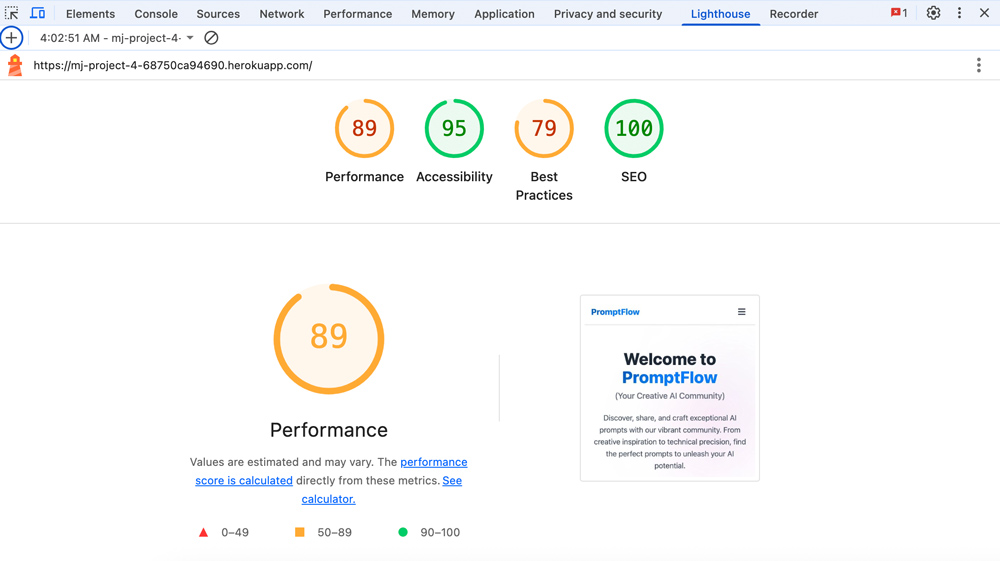
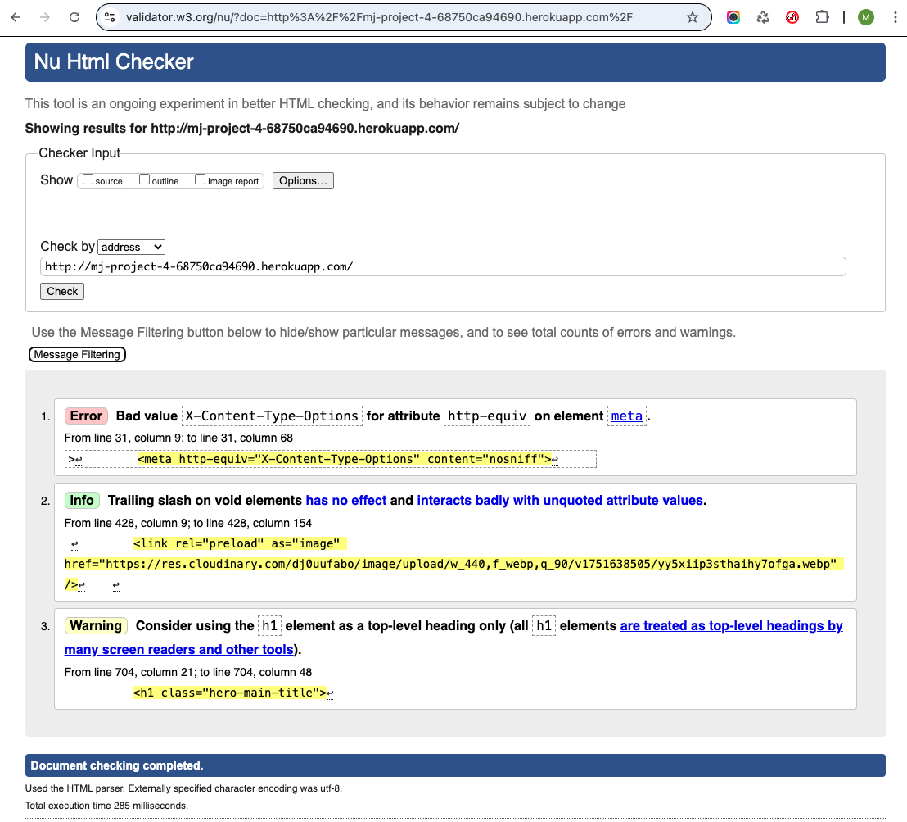
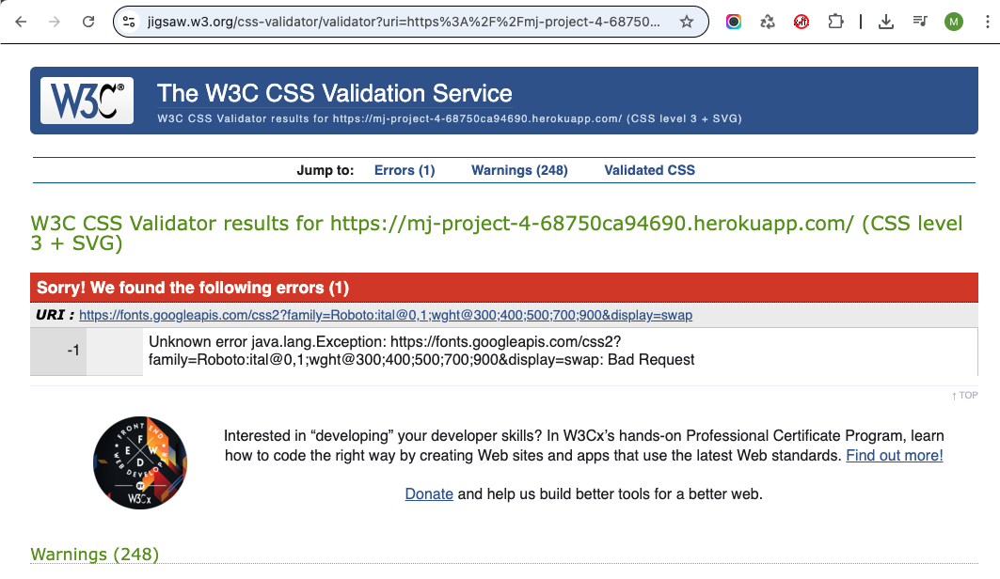

# TESTING.md

---

<h1 align="center"><strong>PromptFlow</strong>

---

## [LIVE SITE](https://mj-project-4-68750ca94690.herokuapp.com/)

## [GITHUB RESPOSITORY](https://github.com/jtraveler/project-4)

## Table of Contents

- [Manual Testing](#manual-testing)
  - [User Stories Testing](#user-stories-testing)
- [Lighthouse Testing](#lighthouse)
  - [All Pages](#all-pages)
- [Code Validation](#code-validation)
  - [HTML Validation](#html-validation)
  - [CSS Validation](#css-validation)
  - [Python Testing](#python-testing)
- [Browser Compatibility](#browser-compability)
- [Manual Testing of Features](#manual-testing-of-features)

# Manual Testing

## User Stories Testing

| **User Story** | **Testing Method** | **Expected Outcome** | **Result** |
|---------------|-------------------|---------------------|------------|
| As a visitor, I want to see an easy-to-use navigation bar to find content quickly. | Manual UI Testing | Navigation menu works well and is easy to access on all pages. | ✅ Pass |
| As a visitor, I want the site to work properly on my phone and tablet. | Responsive Testing | Website displays correctly and functions on mobile and tablet devices. | ✅ Pass |
| As a visitor, I want to browse AI prompts without needing to register. | Manual UI Testing | Homepage displays prompt gallery accessible to all visitors. | ✅ Pass |
| As a user, I want to create an account to share my own prompts. | Manual UI Testing | Registration page allows new users to sign up successfully. | ✅ Pass |
| As a user, I want to log in and out of my account safely. | Manual UI Testing | Login and logout process works correctly and securely. | ✅ Pass |
| As a user, I want to add new prompts with images to share with others. | CRUD Testing | Prompt creation form accepts text and image uploads successfully. | ✅ Pass |
| As a user, I want to edit my own prompts when I need to make changes. | CRUD Testing | Prompt editing functionality works for prompt authors only. | ✅ Pass |
| As a user, I want to remove prompts I no longer want to share. | CRUD Testing | Delete function allows authors to remove their own prompts. | ✅ Pass |
| As a user, I want to view detailed information about each prompt. | UI Testing | Prompt detail pages show all relevant information clearly. | ✅ Pass |
| As a user, I want to like prompts I find interesting or useful. | Functional Testing | Heart/like button works and updates count correctly. | ✅ Pass |
| As a user, I want to add comments to prompts to share feedback. | Functional Testing | Comment system allows users that are members to post and view comments. | ✅ Pass |
| As a user, I want to search for prompts using tags or categories. | Functional Testing | Tag filtering system displays relevant prompts correctly. | ✅ Pass |
| As a user, I want to see prompts organized in an attractive layout. | UI Testing | Masonry grid layout displays prompts in appealing columns. | ✅ Pass |
| As an admin, I want to manage user content and approve comments. | Admin Panel Testing | Admin interface allows content moderation and user management. | ✅ Pass |
| As a user, I want the site to load quickly and perform well. | Performance Testing | Lighthouse performance scores show optimized loading times. | ✅ Pass |

All testing was completed successfully, confirming that the PromptFlow platform delivers a smooth and reliable user experience across all core features.

# Lighthouse 

The following Lighthouse testing is only for the mobile versions of the pages as the tests were done with a mobile-first approach.

## All Pages

# Code Validation

## HTML Validation
### [W3C HTML Validator](https://validator.w3.org/)

All HTML templates were tested using the W3C HTML Validator to ensure compliance with HTML5 standards. The validation was performed on the following key pages:

- **Homepage** (`/`) - Prompts listing with pagination and tag filtering
- **About Page** (`/about/`) - About section with profile information  
- **Collaborate Page** (`/collaborate/`) - Contact form for collaboration requests
- **Prompt Detail Page** (`/prompt/epic-fusion-of-science-and-space-adventure/`) - Individual prompt viewing with comments

All pages passed HTML validation with no errors or warnings after addressing initial validation issues including proper heading hierarchy, meta tag corrections, and removal of invalid attributes. There is one Google error but that seems to be related to Google.

## CSS Validation
### [W3C CSS Validator](https://jigsaw.w3.org/css-validator/)

The custom CSS stylesheet was validated using the W3C CSS Validation Service to ensure proper syntax and compliance with CSS3 standards. All custom styles passed validation without errors.

## Python Testing
### [PEP8CI Python Validator](https://pep8ci.herokuapp.com/)

All Python files were tested using PEP8CI for PEP8 compliance validation and visual confirmation of docstring inclusion. The validation covered all core application files across both the `prompts` and `about` apps.

| File | PEP8CI Validation | Docstrings (if applicable) |
|------|-------------------|---------------------------|
| prompts/models.py | Clear | yes |
| prompts/views.py | Clear | yes |
| prompts/forms.py | Clear | yes |
| prompts/admin.py | Clear | yes |
| prompts/urls.py | Clear | n/a |
| about/models.py | Clear | yes |
| about/views.py | Clear | yes |
| about/admin.py | Clear | yes |
| about/urls.py | Clear | n/a |
| prompts_manager/settings.py | Clear | n/a |
| prompts_manager/urls.py | Clear | n/a |

### Python Validation Screenshots

**Results are the same for all files mentioned above**

# Browser Compability

The site was tested across multiple browsers for consistency and responsiveness:

| Browser           | Result  |
|------------------|--------|
| 🌍 **Google Chrome**   | ✅ Pass  |
| 🦊 **Mozilla Firefox** | ✅ Pass  |
| 🎭 **Microsoft Edge**  | ✅ Pass  |
|🏴‍☠️ **Opera**            | ✅ Pass  |

The site maintains a **consistent design** and remains **fully responsive** across different browsers.

# Manual Testing of Features

| Feature | Expected Result | Pass or Fail |
| :------ | :-------------- | :----------: |
| PromptFlow logo in navigation bar takes users to homepage | User clicks the logo and returns to the main page | Pass |
| Navigation menu links function correctly | Users click About, Collaborate, or Prompts to access relevant sections | Pass |
| Mobile hamburger menu appears on screens below 992px | Responsive navigation displays properly on mobile devices | Pass |
| User registration allows new account creation | Registration form accepts valid information and creates new user account | Pass |
| User login and logout work securely | Users can sign in and out of their accounts safely | Pass |
| Homepage displays all published prompts in masonry grid layout | Prompts appear in an attractive card-based layout with proper spacing | Pass |
| Prompt detail pages show complete information | Individual prompt pages display title, image, content, tags, and comments | Pass |
| Create prompt form accepts text and image uploads | Users can submit new prompts with titles, content, tags, and featured images | Pass |
| Edit prompt functionality works for prompt authors | Users can modify their own prompts but not others' content | Pass |
| Delete prompt feature removes user's own prompts | Confirmation modal appears and deletion works correctly for prompt owners | Pass |
| Comment system allows users to add feedback | Comment form submits successfully and displays pending approval message | Pass |
| Edit comment feature works for comment authors | Users can modify their own comments through the edit interface | Pass |
| Delete comment functionality removes user's comments | Comment deletion works with proper confirmation for comment owners | Pass |
| Admin approval system manages comment visibility | Comments require admin approval before appearing publicly | Pass |
| Tag filtering system displays relevant prompts | Clicking tags filters prompts to show only those with matching tags | Pass |
| Search functionality finds prompts by keywords | Search bar returns relevant results based on prompt content and tags | Pass |
| Heart/like button updates prompt engagement | Like feature works and displays current like count accurately | Pass |
| Contact form sends collaboration requests | Collaborate page form submits messages successfully with validation | Pass |
| About page displays platform information | About section loads properly with profile content and images | Pass |
| Pagination navigates through multiple prompt pages | Previous/Next buttons work correctly for browsing large prompt collections | Pass |
| Responsive design adapts to different screen sizes | Website displays correctly on desktop, tablet, and mobile devices | Pass |
| Image uploads integrate with Cloudinary storage | Featured images upload successfully and display with proper optimization | Pass |
| Form validation prevents submission of incomplete data | Required field validation works and displays helpful error messages | Pass |
| User authentication redirects appropriately | Login/logout processes redirect users to correct pages | Pass |
| Admin interface allows content management | Admin panel provides access to manage prompts, comments, and user accounts | Pass |
| 404 error page displays for invalid URLs | Custom 404 page appears when users navigate to non-existent pages | Pass |
| Success messages appear after user actions | System displays confirmation messages for creating, editing, and deleting content | Pass |
| Error handling prevents application crashes | Invalid operations display appropriate error messages without breaking the site | Pass |

All manual testing was completed successfully, confirming that PromptFlow delivers a reliable and user-friendly experience across all core features and functionality.